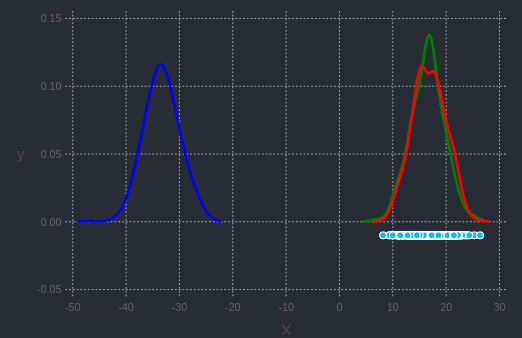

# FisherRaoDistance

[](https://travis-ci.com/wadehenning/FisherRaoDistance.jl)
[](https://ci.appveyor.com/project/wadehenning/FisherRaoDistance-jl)
[](https://codecov.io/gh/wadehenning/FisherRaoDistance.jl)
[](https://coveralls.io/github/wadehenning/FisherRaoDistance.jl?branch=master)


This is a repository for calculating the Fisher-Rao Distance between densities and performing hypothesis testing.

# Overview
In addition to the fact that the Fisher-Rao Distance is a proper distace metric, key advantages of using the Fisher-Rao Distance for comparing sets of data are that it can be used:
 * parametrically or non-parametrically
 * for scalar or multi-dimensional data
 * in various domains (i.e.  **R<sup>n</sup>** or **S<sup>n</sup>**  ) by changing the form of the density

 In this current implementation, we use a nonparametric Gaussian KDE and LOOCV for calculating its bandwidth parameter.


## Example 1: Framework Usage
For this example we generate and compare three data sets generated from a Normal Distribution in **R<sup>10</sup>** and mapped to **R**.


```
using FisherRaoDistance
using KernelDensityEstimatePlotting #currently not working in Atom; needs Atom dev update

```
The density estimation requires sets of points.  These points can either be the original data or can be the result of some sort of dimension reduction.  This example calculates pairwise distances and uses those in a classicalMDS setting
#### Generate the Points and Perform Dimension Reduction
```#note that the Fisher-Rao distance does not require the sets to have the same number of points.
points1 = randn(10, 500)
points2 = randn(10, 500)
points3 = randn(10, 500) + ones(1, 500) * 1.5


#below calculates the pairwise Euclidean distance matrix between the points
#and uses those for classical mds
Points = [points1, points2, points3]
lowdimpoints = get_low_dim_points(Points, 1)
```
#### Estimate the Densities
```
pdf1 = kde!(lowdimpoints[:,:,1])
pdf2 = kde!(lowdimpoints[:,:,2])
pdf3 = kde!(lowdimpoints[:,:,3])

#plot pane is not currently working in Atom-- waiting for Atom dev fix
plot([pdf1; pdf2; pdf3], c = ["red"; "green"; "blue"])
```
<p align="center">

</p>

#### Estimate the Fisher-Rao Distances
```
dfr1_2 = fisherraodistance(
    pdf1,
    pdf2,
    lowdimpoints[:, :, 1],
    lowdimpoints[:, :, 2],
)
```
returns: 0.089
```
dfr1_3 = fisherraodistance(
    pdf1,
    pdf3,
    lowdimpoints[:, :, 1],
    lowdimpoints[:, :, 3],
)
```
returns: 0.495


#### Estimate the Fisher-Rao p-values
```
p1_2 = fisherraotest(pdf1, pdf2, n1, n2, dfr1_2)
```
returns: 0.62
```
p1_3 = fisherraotest(pdf1, pdf3, n1, n3, dfr1_3)
```
 returns: 0.00

## Example 2: Basic Function Usage from KernelDensityEstimate.jl
 ```
 data = rand(100) #generate some random data
 pdf = kde!(data) #estimate a pdf from given data
 data_likelihoods = evaluateDualTree(pdf,data) #get data likelihoods
 sample_points, ind = sample(pdf,100) #sample 100 points from the pdf

 ```
## References
Wade Henning. "A Framework for Comparing Shape Distributions", 2014, Ph.D. Thesis, Florida State University.

Wade Henning, Anuj Srivastava. "A Two-Sample Test for Statistical Comparisons of Shape Populations", 2016, IEEE Winter Conference on Applications in Computer Vision

Anuj Srivastava, Ian Jermyn, Shantanu Joshi. "Riemannian analysis of probability density functions with applications in vision", 2007, IEEE Computer Vision and Pattern Recognition

Erik B. Sudderth, Alexander Ihler, et al. "Nonparametric belief propagation.", 2010, Communications of the ACM
